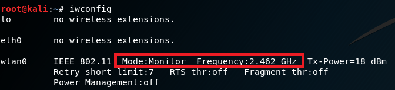

## mis-chap0x02 无线接入网监听

## 一、实验内容
* 进行无线接入网监听，抓取数据包并进行分析。

## 二、实验过程
* 开启无线网卡监听模式
    
    无线网卡类型：RTL8811AU Comfast CF-916AC

    `iwconfig`查看网卡模式

    

    开启监听模式
    ```
    iw dev wlan0 set monitor none
    ```

    

    开始抓包，将抓包数据保存
    ```
    tshark -i wlan0 -w 20181020.pcap -n -s 66535
    ```
    

    wireshark打开已抓取的数据包
    ```
    wireshark 20181020.pcap
    ```
    

    WireShark查看包信息：Statistics->Capture File Properties
   
    老师做实验过程中抓的包：
    * 1015.pcap

    

    自己抓了两次包：
    * 20181020.pcap(校园网环境)

    

    * 20181020-1.pcap(宿舍网环境)

    

## 三、实验练习题
wireshark演示图片以老师做实验过程中抓的包1015.pcap为例
* 通过分析抓包保存的pcap文件：

1. 查看统计当前信号覆盖范围内一共有多少独立的SSID？其中是否包括隐藏SSID？哪些无线热点是加密/非加密的？加密方式是否可知？
    ```
    # -r：后接要分析的文件名
    # -Y：设置过滤条件
    # -T：设置输出格式，选择fields可以控制输出哪些域
    # -e：控制输出哪些域，这里选择输出wlan.sa和wlan.ssid
    # sort -u：去重
    # cat -v：用可打印字符表示不可打印字符，与空字符区分

    tshark -r 1015.pcap -Y wlan.fc.type_subtype==0x08 -T fields -e wlan.sa -e wlan.ssid | sort -u | cat -v  > beacon1015.list
    ```
    beacon1015.list
    ```
    1c:dd:ea:7a:a1:fd	OPPO R11
    28:2c:b2:9f:28:d0	A916
    40:31:3c:00:be:89	Xiaomi_BE88
    82:86:f2:29:c7:f0	XIN
    88:11:96:c5:8c:7c	HUAWEI P20
    b8:f8:83:5f:c2:f4	TP-LINK_C2F4
    e0:05:c5:d5:88:76	gamelab
    ```
    beacon1020.list
    ```
    00:27:1d:04:91:63	0	CMCC-WEB
    00:27:1d:04:99:55	0	CMCC-WEB
    00:27:1d:04:9d:51	0	CMCC-WEB
    00:27:1d:04:9d:91	0	CMCC-WEB
    00:27:1d:05:9d:51	1	CMCC
    00:27:1d:05:9d:91	1	CMCC
    00:27:1d:06:99:55	0	and-Business
    00:27:1d:06:9d:51	0	and-Business
    00:27:1d:06:9d:91	0	and-Business
    06:74:9c:96:ce:78	0	CUC-Guest
    06:74:9c:96:ce:d7	0	CUC-Guest
    06:74:9c:96:ce:ff	0	CUC-Guest
    06:74:9c:96:d0:11	0	CUC-Guest
    06:74:9c:96:d0:12	0	CUC-Guest
    06:74:9c:96:d0:bb	0	CUC-Guest
    06:74:9c:96:d0:bc	0	CUC-Guest
    06:74:9c:97:65:bc	0	CUC-Guest
    06:74:9c:97:65:bd	0	CUC-Guest
    06:74:9c:97:66:21	0	CUC-Guest
    06:74:9c:97:73:59	0	CUC-Guest
    06:74:9c:97:73:5a	0	CUC-Guest
    06:74:9c:97:74:d1	0	CUC-Guest
    06:74:9c:97:74:e4	0	CUC-Guest
    06:74:9c:97:74:e5	0	CUC-Guest
    06:74:9c:97:75:44	0	CUC-Guest
    06:74:9c:97:75:58	0	CUC-Guest
    0a:74:9c:96:ce:78	1	CUC-WiFi
    0a:74:9c:96:ce:d7	1	CUC-WiFi
    0a:74:9c:96:ce:fe	1	CUC-WiFi
    0a:74:9c:96:ce:ff	1	CUC-WiFi
    0a:74:9c:96:d0:11	1	CUC-WiFi
    0a:74:9c:96:d0:12	1	CUC-WiFi
    0a:74:9c:96:d0:bb	1	CUC-WiFi
    0a:74:9c:96:d0:bc	1	CUC-WiFi
    0a:74:9c:97:65:bc	1	CUC-WiFi
    0a:74:9c:97:65:bd	1	CUC-WiFi
    0a:74:9c:97:66:20	1	CUC-WiFi
    0a:74:9c:97:66:21	1	CUC-WiFi
    0a:74:9c:97:73:5a	1	CUC-WiFi
    0a:74:9c:97:74:99	1	CUC-WiFi
    0a:74:9c:97:74:9a	1	CUC-WiFi
    0a:74:9c:97:74:d0	1	CUC-WiFi
    0a:74:9c:97:74:d1	1	CUC-WiFi
    0a:74:9c:97:74:e4	1	CUC-WiFi
    0a:74:9c:97:74:e5	1	CUC-WiFi
    0a:74:9c:97:75:44	1	CUC-WiFi
    0a:74:9c:97:75:57	1	CUC-WiFi
    0a:74:9c:97:75:58	1	CUC-WiFi
    0a:74:9c:97:9c:d1	1	CUC-WiFi
    4e:b5:7d:32:36:6e	1	360������WiFi-OV  # 360免费WiFi-OV
    94:e9:79:25:9d:d6	1	��������������������� #我网不好你别连
    ```
    beacon1020-1.list
    ```
    30:99:35:6a:31:69	1	CU_E37p
    46:04:44:xx:xx:xx	1	OPPO R9m
    80:f6:2e:dc:63:e0	0	ChinaNet
    80:f6:2e:dc:63:f0	0	ChinaNet
    92:1a:a9:c1:f8:7a	0	CMCC-WEB
    92:1a:a9:c1:f8:7b	1	CMCC
    92:1a:a9:c1:f8:7c	0	CMCC-EDU
    92:1a:a9:c1:f8:7d	0	CUC
    92:1a:a9:c1:f8:7e	0	and-Business
    9c:6f:52:6d:ee:c9	1	CU_H44H
    9c:6f:52:6d:ef:50	1	CU_t4Qd
    9c:6f:52:6e:20:a3	1	CU_DTxK
    9c:6f:52:6e:67:7a	1	CU_QdUZ
    9c:6f:52:6e:ba:45	1	CU_tqRE
    9c:6f:52:6f:05:4b	1	CU_fPqv
    ```
* wlan名称UTF-8格式显示乱码问题：

    wireshark过滤条件：wlan.sa==4e:b5:7d:32:36:6e (需转码WiFi的mac地址)

    选中，查看SSID值，以16进制字符流（Hex Stream)形式复制
    ```
    # php -a
    > echo hex2bin("需转换的16进制字符流");
    ```
    也可利用scapy实现自动化转码
    
    ```python
    # wifi.py
    from scapy.all import *

    packets = rdpcap("20181020.pcap")
    aps=[]
    for pkt in packets:
        if pkt.haslayer(Dot11):
            if pkt.type == 0 and pkt.subtype == 8:
                if pkt.addr2 not in aps:
                    aps.append(pkt.addr2)
                    cap = pkt.sprintf("{Dot11Beacon:%Dot11Beacon.cap%}{Dot11ProbeResp:%Dot11ProbeResp.cap%}")
                    if re.search('privacy', cap):
                        a = '%s\t1\t%s'%(pkt.addr2, pkt.info)
                        with open('test.txt', 'a+') as t:
                            t.write(a+'\n')
                            print(a)
                    else:
                        b = '%s\t0\t%s'%(pkt.addr2, pkt.info)
                        with open('test.txt', 'a+') as t:
                            t.write(b+'\n')
                            print(b)
    ```

    

    根据Probe Response获得SSID：
    ```
    tshark -r 1015.pcap -Y wlan.fc.type_subtype==5 -T fields -e wlan.sa -e wlan.ssid | cat -v | sort -u > proresponse1015.list
    ```
    proresponse1015.list
    ```
    1c:dd:ea:7a:a1:fd	1	OPPO R11
    28:2c:b2:9f:28:d0	1	A916
    40:31:3c:00:be:89	1	Xiaomi_BE88
    52:1a:a9:c1:f9:06	0	CUC-Guest
    52:1a:a9:c1:f9:07	1	CUC-WiFi
    82:86:f2:29:c7:f0	1	XIN
    88:11:96:c5:8c:7c	1	HUAWEI P20
    b8:f8:83:5f:c2:f4	1	TP-LINK_C2F4
    d2:1a:a9:c1:f8:ce	0	CUC-Guest
    d2:1a:a9:c1:f8:cf	1	CUC-WiFi
    d2:1a:a9:c2:00:de	0	CUC-Guest
    d2:1a:a9:c2:00:df	1	CUC-WiFi
    e0:05:c5:d5:88:76	1	gamelab

    ```
    proresponse1020.list
    ```
    00:27:1d:04:9d:91	0	CMCC-WEB
    00:27:1d:05:9d:51	1	CMCC
    00:27:1d:05:9d:91	1	CMCC
    00:27:1d:06:99:55	0	and-Business
    00:27:1d:06:9d:91	0	and-Business
    06:74:9c:96:ce:d7	0	CUC-Guest
    06:74:9c:96:ce:ff	0	CUC-Guest
    06:74:9c:96:d0:11	0	CUC-Guest
    06:74:9c:96:d0:12	0	CUC-Guest
    06:74:9c:97:65:bd	0	CUC-Guest
    06:74:9c:97:66:21	0	CUC-Guest
    06:74:9c:97:74:e5	0	CUC-Guest
    06:74:9c:97:75:57	0	CUC-Guest
    06:74:9c:97:75:58	0	CUC-Guest
    0a:74:9c:96:ce:d7	1	CUC-WiFi
    0a:74:9c:96:ce:ff	1	CUC-WiFi
    0a:74:9c:96:d0:11	1	CUC-WiFi
    0a:74:9c:96:d0:12	1	CUC-WiFi
    0a:74:9c:97:65:bd	1	CUC-WiFi
    0a:74:9c:97:66:21	1	CUC-WiFi
    0a:74:9c:97:74:e5	1	CUC-WiFi
    0a:74:9c:97:75:58	1	CUC-WiFi
    4e:b5:7d:32:36:6e	1	360������WiFi-OV # 360免费WiFi-OV
    ```
    proresponse1020-1.list
    ```
    12:1a:a9:c1:f8:a3	1	CMCC
    12:1a:a9:c1:f8:a4	0	CMCC-EDU
    12:1a:a9:c1:f8:a5	0	CUC
    12:1a:a9:c1:f8:a6	0	and-Business
    30:99:35:6a:31:69	1	CU_E37p
    46:04:44:xx:xx:xx	1	OPPO R9m
    80:f6:2e:dc:63:e0	0	ChinaNet
    80:f6:2e:dc:63:f0	0	ChinaNet
    92:1a:a9:c1:f8:7a	0	CMCC-WEB
    92:1a:a9:c1:f8:7b	1	CMCC
    92:1a:a9:c1:f8:7c	0	CMCC-EDU
    92:1a:a9:c1:f8:7d	0	CUC
    92:1a:a9:c1:f8:7e	0	and-Business
    9c:6f:52:6d:ee:c9	1	CU_H44H
    9c:6f:52:6d:ef:50	1	CU_t4Qd
    9c:6f:52:6e:20:a3	1	CU_DTxK
    ```
    SSID去重
    ```
    # -m 合并
    # -k3 -u 根据第三列的值去重

    sort -m proresponse1015.list beacon1015.list | cat -v | sort -k3 -u > ssid1015.list

    cat ssid1015.list
    ```
    ssid1015.list
    ```
    28:2c:b2:9f:28:d0	1	A916
    52:1a:a9:c1:f9:06	0	CUC-Guest
    52:1a:a9:c1:f9:07	1	CUC-WiFi
    e0:05:c5:d5:88:76	1	gamelab
    88:11:96:c5:8c:7c	1	HUAWEI P20
    1c:dd:ea:7a:a1:fd	1	OPPO R11
    b8:f8:83:5f:c2:f4	1	TP-LINK_C2F4
    40:31:3c:00:be:89	1	Xiaomi_BE88
    82:86:f2:29:c7:f0	1	XIN
    ```
    ssid1020.list
    ```
    94:e9:79:25:9d:d6	1	��������������������� # 我网不好你别连
    4e:b5:7d:32:36:6e	1	360������WiFi-OV # 360免费WiFi-OV
    00:27:1d:06:99:55	0	and-Business
    00:27:1d:05:9d:51	1	CMCC
    00:27:1d:04:91:63	0	CMCC-WEB
    06:74:9c:96:ce:78	0	CUC-Guest
    0a:74:9c:96:ce:78	1	CUC-WiFi
    ```
    ssid1020-1.list
    ```
    12:1a:a9:c1:f8:a6	0	and-Business
    80:f6:2e:dc:63:e0	0	ChinaNet
    12:1a:a9:c1:f8:a3	1	CMCC
    12:1a:a9:c1:f8:a4	0	CMCC-EDU
    92:1a:a9:c1:f8:7a	0	CMCC-WEB
    12:1a:a9:c1:f8:a5	0	CUC
    9c:6f:52:6e:20:a3	1	CU_DTxK
    30:99:35:6a:31:69	1	CU_E37p
    9c:6f:52:6f:05:4b	1	CU_fPqv
    9c:6f:52:6d:ee:c9	1	CU_H44H
    9c:6f:52:6e:67:7a	1	CU_QdUZ
    9c:6f:52:6d:ef:50	1	CU_t4Qd
    9c:6f:52:6e:ba:45	1	CU_tqRE
    46:04:44:xx:xx:xx	1	OPPO R9m
    ```
    计数
    ```
    # wc -l ssid.list

    9 ssid1015.list
    7 ssid1020.list
    15 ssid1020-1.list
    ```
    由于没有抓到隐藏的SSID，故独立的ssid分别有9个，7个，15个

    隐藏的SSID：不广播信标帧只回复帧响应；或者广播信标帧但SSID在机器上显示为空（实际上是用一串0x00填充）

    隐藏的SSID并不能提供可靠的安全，因为即使 SSID 隐藏而且不广播，当正常的客户端尝试连接到接入点时，它们就交换了探测请求和响应的封包。这些封包包含接入点的 SSID。由于这些封包没有加密，它们可以被非常轻易地嗅探来发现SSID。更主动的方法还有进行接触验证，强制客户端断开接入点的连接，通过发送伪造的解除验证封包。这些封包会强迫客户端重新连接到接入点上，从而获取 SSID。


* 根据wlan.fixed.capabilities.privacy判断是否加密
    * 0：非加密
    * 1：加密

    ```
    tshark -r 1015.pcap -Y wlan.fc.type_subtype==0x08 -T fields -e wlan.sa -e wlan.fixed.capabilities.privacy -e wlan.ssid | sort -d -k2 -u
    ```
    1015.pcap
    ```
    28:2c:b2:9f:28:d0	1	A916
    e0:05:c5:d5:88:76	1	gamelab
    88:11:96:c5:8c:7c	1	HUAWEI P20
    1c:dd:ea:7a:a1:fd	1	OPPO R11
    b8:f8:83:5f:c2:f4	1	TP-LINK_C2F4
    40:31:3c:00:be:89	1	Xiaomi_BE88
    82:86:f2:29:c7:f0	1	XIN
    ```
    20181020.pcap
    ```
    00:27:1d:06:99:55	0	and-Business
    00:27:1d:04:9d:91	0	CMCC-WEB
    06:74:9c:96:d0:bb	0	CUC-Guest
    94:e9:79:25:9d:d6	1	��������������������� # 我网不好你别连
    4e:b5:7d:32:36:6e	1	360������WiFi-OV # 360免费WiFi-OV
    00:27:1d:05:9d:91	1	CMCC
    0a:74:9c:96:d0:bb	1	CUC-WiFi
    ```
    20181020-1.pcap
    ```
    92:1a:a9:c1:f8:7e	0	and-Business
    80:f6:2e:dc:63:f0	0	ChinaNet
    92:1a:a9:c1:f8:7c	0	CMCC-EDU
    92:1a:a9:c1:f8:7a	0	CMCC-WEB
    92:1a:a9:c1:f8:7d	0	CUC
    92:1a:a9:c1:f8:7b	1	CMCC
    9c:6f:52:6e:20:a3	1	CU_DTxK
    30:99:35:6a:31:69	1	CU_E37p
    9c:6f:52:6f:05:4b	1	CU_fPqv
    9c:6f:52:6d:ee:c9	1	CU_H44H
    9c:6f:52:6e:67:7a	1	CU_QdUZ
    9c:6f:52:6d:ef:50	1	CU_t4Qd
    9c:6f:52:6e:ba:45	1	CU_tqRE
    46:04:44:xx:xx:xx	1	OPPO R9m
    ```

    过滤条件：`wlan.fc.type_subtype == 0x08 && wlan.fixed.capabilities.privacy`

    

* 根据wlan.fixed.auth.alg判断鉴权方式 
    * 0：OpenSystem，开放系统
    * 1：SharedKey，共享密钥
   
    ```
    tshark -r 20181020.pcap -Y wlan.fixed.auth.alg -T fields -e wlan.sa -e wlan.fixed.auth.alg | sort -d -u
    ```
    1015.pcap
    ```
    1c:dd:ea:7a:a1:fd	0
    40:31:3c:00:be:89	0
    50:7a:55:0a:9b:42	0
    80:a5:89:69:5e:75	0
    ```
    20181020.pcap：未抓到符合要求的包

    20181020-1.pcap
    ```
    46:04:44:a9:0f:54	0
    48:d2:24:53:27:11	0
    54:8c:a0:48:4a:20	0
    ```

    过滤条件：`wlan.fixed.auth.alg`

    

2. 如何分析出一个指定手机在抓包时间窗口内在手机端的无线网络列表可以看到哪些SSID？这台手机尝试连接了哪些SSID？最终加入了哪些SSID？
    
    当收到了AP广播的Beacon帧且SSID不为空时，指定手机才能在无线网络列表中看到该SSID

    过滤条件：`wlan.fc.type_subtype == 0x08 && wlan.ssid`

    

    手机尝试连接无线网络时，广播Probe Request帧。根据Probe Request帧判断这台手机尝试连接了哪些SSID。
    
    过滤条件：`wlan.fc.type_subtype == 0x04`

    

    连接成功时，出现Association Response帧，通过Association Response帧判断这台手机最终加入了哪些SSID。

    过滤条件：`wlan.fc.type_subtype == 0x01`

    


3. SSID包含在哪些类型的802.11帧？
    * Beacon frame
    * Probe Response
    * Probe Request
    * Association Request

    过滤条件：`wlan.ssid`

    

    


## 四、实验总结
* 连接无线网一般流程：
    * AP发送Beacon广播管理帧(Beacon frame)
    * 客户端向承载指定SSID的AP发送探测请求帧(Probe Request)
    * AP接入点对客户端的SSID连接请求进行应答(Probe Response)
    * 客户端对目标AP请求进行身份认证(Authentication)
    * AP对客户端的身份认证请求作出回应(Authentication)
    * 客户端向AP发送连接请求(Association Request)
    * AP对连接请求进行回应(Association Response)
    * 客户端向AP请求断开连接(Disassociate)

* wireshark 部分筛选条件：
    ```
    wlan.fc.type == 0x00           管理帧（Management frames）
    wlan.fc.type == 0x01           控制帧（Control frames）
    wlan.fc.type == 0x02           数据帧（Data frames）
    wlan.fc.type_subtype == 0x00   关联请求（Association request）
    wlan.fc.type_subtype == 0x01   关联响应（Association response）
    wlan.fc.type_subtype == 0x02   重连请求（Reassociation request）
    wlan.fc.type_subtype == 0x03   重连响应（Reassociation response）
    wlan.fc.type_subtype == 0x04   帧请求（Probe request）
    wlan.fc.type_subtype == 0x05   帧响应（Probe response）
    wlan.fc.type_subtype == 0x08   信标（Beacon）
    ```
* wifi部分连接安全标准：
    * WEP：Wired Equivalency Protection，
        
        有两种鉴权方式：Open System；Shared Key
        * Open System:

            这种鉴权方式不需要客户端提供任何credentials，因此，实际上任何客户端都可以尝试与AP进行鉴权和连接，这其中并不存在实际意义上的鉴权。鉴权连接结束，AP用WEP密钥加密数据，这时，客户端就需要正确的Password形成密钥来解密。
        * Shared Key：
            
            通过四次握手并使用WEP加密来完成鉴权

    * WPA：Wi-Fi Protected Access
        
        实现了802.11i的大部分标准，有两种鉴权方式，使用802.1x或使用Pre-Shared Key
    * WPA2：Wi-Fi Protected Access 2
        
        完全实现802.11i标准
    
* 挂载共享文件夹：
    * kalishare：物理主机中共享文件夹名称
    * myshare：mnt中自建的文件夹名称，在此文件夹中找到共享文件
    ```
    mount -t vboxsf kalishare /mnt/myshare
    ```

## 参考资料
* [CUCCS/2018-NS-Public-jckling](https://github.com/CUCCS/2018-NS-Public-jckling/blob/56c7a202aa9c3ab8a38ce402026f6be7a9433ae1/mis-0x02/第二章实验练习题.md)
* [CUCCS/2018-NS-Public-xaZKX](https://github.com/CUCCS/2018-NS-Public-xaZKX/blob/ms-chap02/ms-chap02/chap02-无线接入网监听实验报告.md)
* [textbook/mis/chap0x02/](https://sec.cuc.edu.cn/huangwei/textbook/mis/chap0x02/exp.html)
* [textbook/mis/scapy](https://sec.cuc.edu.cn/huangwei/textbook/mis/chap0x02/scapy.html)
* [获取隐藏Wi-Fi SSID](https://blog.csdn.net/hljzzj/article/details/49088189)
* [隐藏的SSID](https://blog.csdn.net/wizardforcel/article/details/52887083)
* [wifi鉴权方式](https://blog.csdn.net/u011334105/article/details/18733091)


