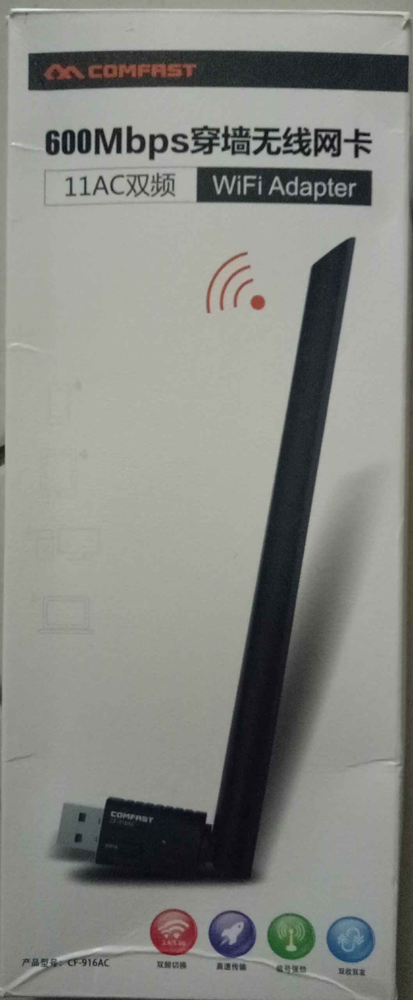
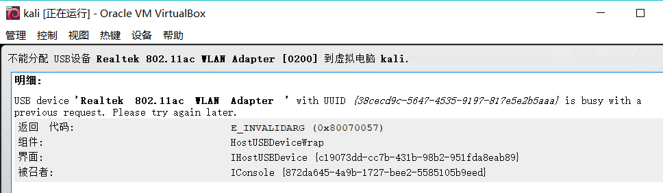

## mis-chap0x00-网卡信息

## Comfast CF-916AC



虚拟机的USB连接设置设置为USB 3.0兼容模式，并手工安装驱动
```
# apt-get update
# apt install realtek-rtl88xxau-dkms
```
这里升级了一下lsusb所使用的USB设备标识数据库，升级后显示了更详细的网卡信息。
```
# update-usbids
```

```
# lsusb -v
Bus 001 Device 003: ID 0bda:a811 Realtek Semiconductor Corp. RTL8811AU 802.11a/b/g/n/ac WLAN Adapter
Device Descriptor:
  bLength                18
  bDescriptorType         1
  bcdUSB               2.10
  bDeviceClass            0 (Defined at Interface level)
  bDeviceSubClass         0 
  bDeviceProtocol         0 
  bMaxPacketSize0        64
  idVendor           0x0bda Realtek Semiconductor Corp.
  idProduct          0xa811 RTL8811AU 802.11a/b/g/n/ac WLAN Adapter
  bcdDevice            2.00
  iManufacturer           1 Realtek 
  iProduct                2 802.11ac WLAN Adapter 
  iSerial                 3 00e04c000001
  bNumConfigurations      1
  Configuration Descriptor:
    bLength                 9
    bDescriptorType         2
    wTotalLength           60
    bNumInterfaces          1
    bConfigurationValue     1
    iConfiguration          0 
    bmAttributes         0xe0
      Self Powered
      Remote Wakeup
    MaxPower              500mA
    Interface Descriptor:
      bLength                 9
      bDescriptorType         4
      bInterfaceNumber        0
      bAlternateSetting       0
      bNumEndpoints           6
      bInterfaceClass       255 Vendor Specific Class
      bInterfaceSubClass    255 Vendor Specific Subclass
      bInterfaceProtocol    255 Vendor Specific Protocol
      iInterface              2 802.11ac WLAN Adapter 
      Endpoint Descriptor:
        bLength                 7
        bDescriptorType         5
        bEndpointAddress     0x84  EP 4 IN
        bmAttributes            2
          Transfer Type            Bulk
          Synch Type               None
          Usage Type               Data
        wMaxPacketSize     0x0200  1x 512 bytes
        bInterval               0
      Endpoint Descriptor:
        bLength                 7
        bDescriptorType         5
        bEndpointAddress     0x05  EP 5 OUT
        bmAttributes            2
          Transfer Type            Bulk
          Synch Type               None
          Usage Type               Data
        wMaxPacketSize     0x0200  1x 512 bytes
        bInterval               0
      Endpoint Descriptor:
        bLength                 7
        bDescriptorType         5
        bEndpointAddress     0x06  EP 6 OUT
        bmAttributes            2
          Transfer Type            Bulk
          Synch Type               None
          Usage Type               Data
        wMaxPacketSize     0x0200  1x 512 bytes
        bInterval               0
      Endpoint Descriptor:
        bLength                 7
        bDescriptorType         5
        bEndpointAddress     0x87  EP 7 IN
        bmAttributes            3
          Transfer Type            Interrupt
          Synch Type               None
          Usage Type               Data
        wMaxPacketSize     0x0040  1x 64 bytes
        bInterval               3
      Endpoint Descriptor:
        bLength                 7
        bDescriptorType         5
        bEndpointAddress     0x08  EP 8 OUT
        bmAttributes            2
          Transfer Type            Bulk
          Synch Type               None
          Usage Type               Data
        wMaxPacketSize     0x0200  1x 512 bytes
        bInterval               0
      Endpoint Descriptor:
        bLength                 7
        bDescriptorType         5
        bEndpointAddress     0x09  EP 9 OUT
        bmAttributes            2
          Transfer Type            Bulk
          Synch Type               None
          Usage Type               Data
        wMaxPacketSize     0x0200  1x 512 bytes
        bInterval               0
Binary Object Store Descriptor:
  bLength                 5
  bDescriptorType        15
  wTotalLength           12
  bNumDeviceCaps          1
  USB 2.0 Extension Device Capability:
    bLength                 7
    bDescriptorType        16
    bDevCapabilityType      2
    bmAttributes   0x00000002
      Link Power Management (LPM) Supported
Device Status:     0x0001
  Self Powered
```

`iw phy`输出结果如下所示：
```
Wiphy phy0
	max # scan SSIDs: 9
	max scan IEs length: 2304 bytes
	max # sched scan SSIDs: 0
	max # match sets: 0
	max # scan plans: 1
	max scan plan interval: -1
	max scan plan iterations: 0
	Retry short limit: 7
	Retry long limit: 4
	Coverage class: 0 (up to 0m)
	Supported Ciphers:
		* WEP40 (00-0f-ac:1)
		* WEP104 (00-0f-ac:5)
		* TKIP (00-0f-ac:2)
		* CCMP-128 (00-0f-ac:4)
	Available Antennas: TX 0 RX 0
	Supported interface modes:
		 * IBSS
		 * managed
		 * AP
		 * monitor
		 * P2P-client
		 * P2P-GO
	Band 1:
		Capabilities: 0x1972
			HT20/HT40
			Static SM Power Save
			RX Greenfield
			RX HT20 SGI
			RX HT40 SGI
			RX STBC 1-stream
			Max AMSDU length: 7935 bytes
			DSSS/CCK HT40
		Maximum RX AMPDU length 65535 bytes (exponent: 0x003)
		Minimum RX AMPDU time spacing: 16 usec (0x07)
		HT Max RX data rate: 476 Mbps
		HT TX/RX MCS rate indexes supported: 0-7
		Bitrates (non-HT):
			* 1.0 Mbps
			* 2.0 Mbps
			* 5.5 Mbps
			* 11.0 Mbps
			* 6.0 Mbps
			* 9.0 Mbps
			* 12.0 Mbps
			* 18.0 Mbps
			* 24.0 Mbps
			* 36.0 Mbps
			* 48.0 Mbps
			* 54.0 Mbps
		Frequencies:
			* 2412 MHz [1] (20.0 dBm)
			* 2417 MHz [2] (20.0 dBm)
			* 2422 MHz [3] (20.0 dBm)
			* 2427 MHz [4] (20.0 dBm)
			* 2432 MHz [5] (20.0 dBm)
			* 2437 MHz [6] (20.0 dBm)
			* 2442 MHz [7] (20.0 dBm)
			* 2447 MHz [8] (20.0 dBm)
			* 2452 MHz [9] (20.0 dBm)
			* 2457 MHz [10] (20.0 dBm)
			* 2462 MHz [11] (20.0 dBm)
			* 2467 MHz [12] (20.0 dBm) (no IR)
			* 2472 MHz [13] (20.0 dBm)
			* 2484 MHz [14] (20.0 dBm) (no IR)
	Band 2:
		Capabilities: 0x1972
			HT20/HT40
			Static SM Power Save
			RX Greenfield
			RX HT20 SGI
			RX HT40 SGI
			RX STBC 1-stream
			Max AMSDU length: 7935 bytes
			DSSS/CCK HT40
		Maximum RX AMPDU length 65535 bytes (exponent: 0x003)
		Minimum RX AMPDU time spacing: 16 usec (0x07)
		HT Max RX data rate: 476 Mbps
		HT TX/RX MCS rate indexes supported: 0-7
		VHT Capabilities (0x03c03122):
			Max MPDU length: 11454
			Supported Channel Width: neither 160 nor 80+80
			short GI (80 MHz)
			SU Beamformee
			+HTC-VHT
		VHT RX MCS set:
			1 streams: MCS 0-9
			2 streams: not supported
			3 streams: not supported
			4 streams: not supported
			5 streams: not supported
			6 streams: not supported
			7 streams: not supported
			8 streams: not supported
		VHT RX highest supported: 434 Mbps
		VHT TX MCS set:
			1 streams: MCS 0-9
			2 streams: not supported
			3 streams: not supported
			4 streams: not supported
			5 streams: not supported
			6 streams: not supported
			7 streams: not supported
			8 streams: not supported
		VHT TX highest supported: 434 Mbps
		Bitrates (non-HT):
			* 6.0 Mbps
			* 9.0 Mbps
			* 12.0 Mbps
			* 18.0 Mbps
			* 24.0 Mbps
			* 36.0 Mbps
			* 48.0 Mbps
			* 54.0 Mbps
		Frequencies:
			* 5180 MHz [36] (20.0 dBm)
			* 5200 MHz [40] (20.0 dBm) (no IR)
			* 5220 MHz [44] (20.0 dBm) (no IR)
			* 5240 MHz [48] (20.0 dBm)
			* 5260 MHz [52] (20.0 dBm) (no IR, radar detection)
			* 5280 MHz [56] (20.0 dBm) (no IR, radar detection)
			* 5300 MHz [60] (20.0 dBm) (no IR, radar detection)
			* 5320 MHz [64] (20.0 dBm) (no IR, radar detection)
			* 5500 MHz [100] (20.0 dBm) (no IR, radar detection)
			* 5520 MHz [104] (20.0 dBm) (no IR, radar detection)
			* 5540 MHz [108] (20.0 dBm) (no IR, radar detection)
			* 5560 MHz [112] (20.0 dBm) (no IR, radar detection)
			* 5580 MHz [116] (20.0 dBm) (no IR, radar detection)
			* 5600 MHz [120] (20.0 dBm) (no IR, radar detection)
			* 5620 MHz [124] (20.0 dBm) (no IR, radar detection)
			* 5640 MHz [128] (20.0 dBm) (no IR, radar detection)
			* 5660 MHz [132] (20.0 dBm) (no IR, radar detection)
			* 5680 MHz [136] (20.0 dBm) (no IR, radar detection)
			* 5700 MHz [140] (20.0 dBm) (no IR, radar detection)
			* 5720 MHz [144] (20.0 dBm) (no IR, radar detection)
			* 5745 MHz [149] (20.0 dBm)
			* 5765 MHz [153] (20.0 dBm)
			* 5785 MHz [157] (20.0 dBm)
			* 5805 MHz [161] (20.0 dBm) (no IR)
			* 5825 MHz [165] (20.0 dBm)
			* 5845 MHz [169] (disabled)
			* 5865 MHz [173] (disabled)
			* 5885 MHz [177] (disabled)
	Supported commands:
		 * new_interface
		 * set_interface
		 * new_key
		 * start_ap
		 * new_station
		 * set_bss
		 * join_ibss
		 * set_pmksa
		 * del_pmksa
		 * flush_pmksa
		 * remain_on_channel
		 * frame
		 * set_channel
		 * connect
		 * disconnect
	Supported TX frame types:
		 * IBSS: 0x00 0x10 0x20 0x30 0x40 0x50 0x60 0x70 0x80 0x90 0xa0 0xb0 0xc0 0xd0 0xe0 0xf0
		 * managed: 0x00 0x10 0x20 0x30 0x40 0x50 0x60 0x70 0x80 0x90 0xa0 0xb0 0xc0 0xd0 0xe0 0xf0
		 * AP: 0x00 0x10 0x20 0x30 0x40 0x50 0x60 0x70 0x80 0x90 0xa0 0xb0 0xc0 0xd0 0xe0 0xf0
		 * AP/VLAN: 0x00 0x10 0x20 0x30 0x40 0x50 0x60 0x70 0x80 0x90 0xa0 0xb0 0xc0 0xd0 0xe0 0xf0
		 * P2P-client: 0x00 0x10 0x20 0x30 0x40 0x50 0x60 0x70 0x80 0x90 0xa0 0xb0 0xc0 0xd0 0xe0 0xf0
		 * P2P-GO: 0x00 0x10 0x20 0x30 0x40 0x50 0x60 0x70 0x80 0x90 0xa0 0xb0 0xc0 0xd0 0xe0 0xf0
	Supported RX frame types:
		 * IBSS: 0xd0
		 * managed: 0x40 0xd0
		 * AP: 0x00 0x20 0x40 0xa0 0xb0 0xc0 0xd0
		 * AP/VLAN: 0x00 0x20 0x40 0xa0 0xb0 0xc0 0xd0
		 * P2P-client: 0x40 0xd0
		 * P2P-GO: 0x00 0x20 0x40 0xa0 0xb0 0xc0 0xd0
	WoWLAN support:
		 * wake up on anything (device continues operating normally)
	software interface modes (can always be added):
		 * monitor
	interface combinations are not supported
	Device supports scan flush.
```
直接使用`airmon-ng start wlan0`无法将该网卡设置为监听模式。错误信息如下：
```
Found 3 processes that could cause trouble.
If airodump-ng, aireplay-ng or airtun-ng stops working after
a short period of time, you may want to run 'airmon-ng check kill'

  PID Name
  441 NetworkManager
  506 dhclient
  733 wpa_supplicant

PHY	Interface	Driver		Chipset

phy0	wlan0		rtl88xxau	Realtek Semiconductor Corp. RTL8811AU 802.11a/b/g/n/ac WLAN Adapter
cat: /sys/class/ieee80211/phy0/device/net/wlan0mon/type: No such file or directory

Newly created monitor mode interface wlan0mon is *NOT* in monitor mode.
Removing non-monitor wlan0mon interface...
Segmentation fault

WARNING: unable to start monitor mode, please run "airmon-ng check kill"
```
结束进程
```
# airmon-ng check kill
```
使用底层的网卡设置工具iw可以将该网卡设置为监听模式，并能正常使用`airodump-ng`进行无线抓包（支持channel hopping）
```
# iw dev wlan0 set monitor none
# airodump-ng wlan0 --band a
# airodump-ng wlan0
```
使用`iw dev`查看网卡基本信息
```
phy#0
	Interface wlan0
		ifindex 3
		wdev 0x1
		addr 40:a5:ef:xx:xx:xx
		type managed
		channel 1 (2412 MHz), width: 20 MHz, center1: 2412 MHz
		txpower 18.00 dBm
```

## **实验问题及解决**
1. 不能分配USB设备到虚拟电脑

    
    
    试了很多百度上的方法都没解决，最后看见一个论坛上说可能是因为宿主机安装wireshark时附带安装的USBpcap的问题，它自动占用了USB设备，遂卸载USBpcap，宿主机重启（非虚拟机），再次运次虚拟机可正常连接到无线网卡。

    [参考论坛地址](https://bbs.csdn.net/topics/392185582?page=1)

2. `iw phy`无输出
  
    已做配置：
    * 设置为USB 3.0兼容模式
    * 安装虚拟机对应版本的VirtualBox_Extension_Pack扩展包

    查看发现安装驱动时并没有安装成功
    ```
    # apt install realtek-rtl88xxau-dkms

    Unpacking realtek-rtl88xxau-dkms (5.2.20.2~20180812-0kali1) ...
    Setting up realtek-rtl88xxau-dkms (5.2.20.2~20180812-0kali1) ...
    Loading new realtek-rtl88xxau-5.2.20.2~20180812 DKMS files...
    Building for 4.17.0-kali1-amd64
    Module build for kernel 4.17.0-kali1-amd64 was skipped since the
    kernel headers for this kernel does not seem to be installed.
    ```
    报错显示没有安装内核头文件
    
    `apt update`更新缓存后，`uname -r`查看内核版本，并安装对应版本头文件linux-headers-4.17.0-kali1-amd64（也可Tab自动补全）
    ```
    # apt-get install linux-headers-4.17.0-kali1-amd64
    ```
    直接安装报错
    ```
    E: Unable to locate package linux-headers-4.17.0-kali1-amd64
    E: Couldn't find any package by glob 'linux-headers-4.17.0-kali1-amd64'
    E: Couldn't find any package by regex 'linux-headers-4.17.0-kali1-amd64'
    ```
	[安装内核头文件参考](https://blog.csdn.net/qq_21774161/article/details/68070594)
   
    按参考操作，需要下载内核头文件自己编译，在[下载地址](http://http.kali.org/kali/pool/main/l/linux/)并没有找到4.17.0-kali1版本的头文件。
   
    需要升级到4.18.0-kali2版本。[参考](http://www.kali.org.cn/thread-26588-1-1.html)，但升级过程还未解决。
    
	暂时先拷贝了同学已配置好的虚拟机.ova文件，可以正常安装驱动。

   

