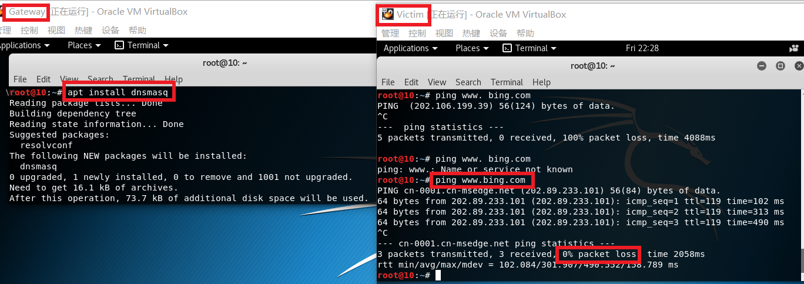

# chap0x01
## 基于VirtualBox的网络攻防基础环境搭建实例讲解
## 一、实验要求
* 节点：靶机、网关、攻击者主机
* 连通性 
    * 靶机可以直接访问攻击者主机
    * 攻击者主机无法直接访问靶机
    * 网关可以直接访问攻击者主机和靶机
    * 靶机的所有对外上下行流量必须经过网关
    * 所有节点均可以访问互联网
* 其他要求 
    * 所有节点制作成基础镜像（多重加载的虚拟硬盘）
## 二、实验过程
1. 画好网络拓扑图

    （由于只是为了示意网络拓扑关系，未为各台设备配置ip等，故绿灯未亮）

    

2. 配置好三台虚拟机Attacker，Victim，Gateway
    * 新建一台虚拟机Attacker
        * 为虚拟机Attacker添加虚拟硬盘Attacker.vdi
    * 在虚拟机关闭状态下，选择管理-> 虚拟介质加载，选中Attacker.vdi，点击释放,释放后再次选中，类型修改为多重加载，应用。
    
        
     
        可以看到Attacker虚拟硬盘类型已修改为多重加载
     
        

    * 使用已有虚拟硬盘新建两个虚拟机Victim和Gateway

        
        
        由于Attacker，Victim，Gateway使用同一块虚拟硬盘Attacker.vdi,故模式均为多重加载。
    * 设置网卡
        * victim有一块网卡，类型为intnet（内部网络）
        
        

        * Gateway分配两块网卡，网卡1为NatNetwork，网卡2为intnet。
        
        

        

        * Attacker有一块网卡，设置为NatNetwork模式
        
        

3. 为Attacker，Victim，Gateway分别配置ip网络
    * victim网络配置
        
        ```
        ifconfig
        ```
        

        Victim为内部网络，需要手动分配静态ip

        用kali系统自带文本编辑器leafpad打开interfaces接口文件
        ```
        leafpad /etc/network/interfaces
        ```
        在interfaces文件中写入：
        ```
        auto eth0
        iface eth0 inet static
        address 192.168.100.4
        netmask 255.255.255.0
        gateway 192.168.100.1
        ```
        **注**：由于前面已分配好网卡，故这里使用auto也是可行的，推荐使用**allow-hotplug**允许网卡热插拔，网卡不存在时也能正常配置。

        
    
        ```
        ifconfig
        ```
        显示Victim的eth0接口ip地址为192.168.100.4
        
        

    * Gateway网络配置
    
        ```
        leafpad /etc/network/interfaces
        ```
        打开interfaces接口文件，配置接口eth0为动态分配ip，配置eth1为静态ip：192.168.100.1
        ```
        auto eth0
        iface eth0 inet dhcp

        auto eth1
        iface eth1 inet static
        address 192.168.100.1
        netmask 255.255.255.0
        ``` 
        
        
        配置好后，save保存，在终端再输入ifconfig查看，显示eth0：10.02.14；eth1：192.168.100.1

        
    * Attacker网络配置
        
        Attacker接口eth0动态分配ip地址，在interfaces文件中写入：
        ```
        auto eth0
        iface eth0 inet dhcp
        ```

        save保存，终端输入ifconfig，显示Attacker的eth0接口ip为10.0.2.4

        

4. 查看靶机、攻击者主机、网关及外网之间的联通情况
    * 未做任何配置时
        * 攻击者主机可以ping通网关，不能ping通靶机；
            ```
            ping 10.0.2.15
            ```
            ```
            ping 192.168.100.4
            ```
    
            
    
        * 网关可以ping通靶机和攻击者主机；
            ```
            ping 192.168.100.4
            ```
            ```
            ping 10.0.2.4
            ```
    
            

        * 靶机可以ping通网关，不能ping通攻击者主机。
            ```
            ping 192.168.100.1
            ```
            ```
            ping 10.0.2.4
            ```
            

            

        * 攻击者主机和网关可以ping通外网
            ```
            ping www.baidu.com
            ```
            

        * 靶机不能ping通外网
            ```
            ping sec.cuc.edu.cn
            ```
            

5. 配置使靶机可以ping通攻击者主机
    * 配置前靶机不能ping通攻击者主机

        * 网关监测靶机ping攻击者主机时的传输情况，发现只有request包，没有reply包。
            ```
            tcpdump -n -i eth0 icmp
            ```
        
            
    
        * 查看网关路由表发现，网关没有配置回复所需路由
            ```
            route -n
            ```
    
            

    * 开启ipv4转发
        * 一种方法是在网关中配置： 
            ```
            echo 1 > /proc/syc/net/ipv4/ip_forward
            ```
            这种方法是临时的，重启后失效。
        * 为实现永久开启
            
            需写入配置文件使ip_forward字段为1
            ```
            leafpad /proc/syc/net/ipv4/ip_forward
            ```

            

    * 添加路由，允许192.168.100.0/24网段的访问
        ```
        iptables -t nat -A POSTROUTING -s 192.168.100.0/24 -o eth0 -j MASQUERADE
        ```
        此处不需再使用iptables-save，避免重复操作
        
        

    * 配置完成，此时靶机可以ping通攻击者主机
        ```
        ping 10.0.2.4
        ```
        

6. 配置DNS服务器使靶机能通过域名访问外网
    * 在网关上配置DNS域名解析服务器
        ```
        apt install dnsmasq
        ```
        配置完成后靶机可以通过域名访问外网
        
        

    * 靶机上下行流量均经过网关

        监测网关的eth0接口

        ```
        tcpdump -n -i eth0 icmp
        ```
        

## 三、实验总结
1. 实验问题及解决
    * 无法定位软件包

        

        解决方法：打开sources.list配置文件，添加官方镜像源
        ```
        leafpad /etc/apt/sources.list
        ```
        写入：
        ```
        deb http://http.kali.org/kali kali-rolling main contrib non-free
        ```
        save保存。
        
        更新
        ```
        apt-get update
        ```
        此后可正常安装增强功能
        ```
        apt-get install -y virtualbox-guest-x11
        ```
    * 无法添加第二块网卡
        
        解决：与虚拟机设置相关的硬件配置，必须在虚拟机**关闭**状态（非休眠）下进行操作。
    
2. 命令及规则学习
    * tcpdump
    * iptables


