 ## chap0x05 TCP connect scan/TCP stealth scan/TCP XMAS scan/UDP scan
 ## 一、实验目标

自己动手编程实现并讲解

* TCP connect scan
* TCP stealth scan
* TCP XMAS scan
* UDP scan
 ## 二、实验过程

 ### 1. 为两台主机配置ip地址，使其处于同一局域网
* 网络拓扑图

    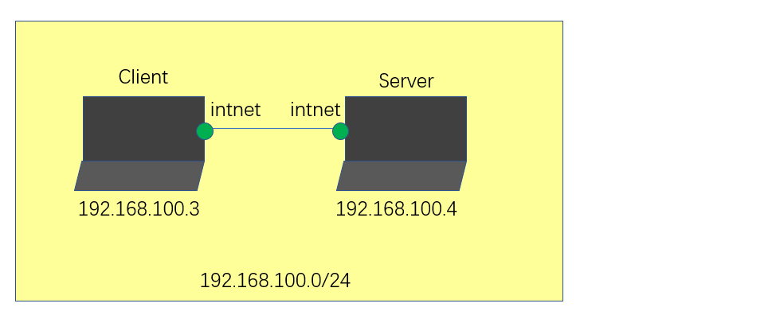
* client
    
    沿用实验ns-chap0x01中的Attacker，需要做的改动是将ip地址修改到与server处于同一局域网。

    * 修改网卡类型为intnet(内部网络)

    * 打开接口配置文件，手动配置ip为192.168.100.3
    ```
    leafpad /etc/network/interfaces
    ```
    ```
    allow-hotplug eth0
    iface eth0 inet static
    address 192.168.100.3
    netmask 255.255.255.0
    gateway 192.168.100.1
    ```
* server

    沿用实验ns-chap0x01中的Victim

    网卡类型：intnet

    ip:192.168.100.4


### **TCP connect scan**
开放扫描。

使用最基本的 TCP 三次握手链接建立机制，建立一个链接到目标主机的特定端口上。首先发送一个 SYN 数据包到目标主机的特定端口上，接着我们可以通过接收包的情况对端口的状态进行判断：如果接收到的是一个 SYN/ACK 数据包，则说明端口是开放状态的；如果接收到的是一个 RST/ACK 数据包，通常意味着端口是关闭的并且链接将会被重置；而如果目标主机没有任何响应则意味着目标主机的端口处于过滤状态。

当SYN扫描不能用时，TCP Connect Scan是默认的TCP扫描。

server：监听eth0
```
tcpdump -i eth0 -w connect.pcap
```
client：执行代码[TCPConnectScan.py](TCPConnectScan.py)
```
python TCPConnectScan.py
```
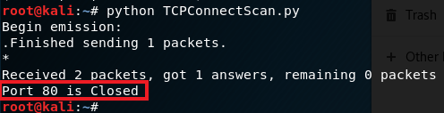

可以看到80端口处于关闭状态。

server：`wireshark connect.pcap`

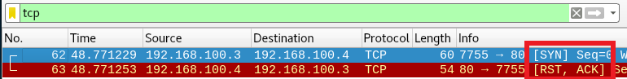

wireshark查看server抓到的包发现进行了[SYN]和[RST,ACK]两步。

端口关闭时进行的流程：


Client中用Nmap扫描，显示80端口关闭。与执行scapy代码方式的抓包结果相同。
```
# -sT 对TCP进行扫描，默认扫描模式即TCP connect scan
# -p  后接扫描端口号
# -PN 禁用Nmap网络发现功能，告诉发信主机远程主机是存活的，故没有必要发送ping请求

nmap -sT -p80 -PN 192.168.100.4
```

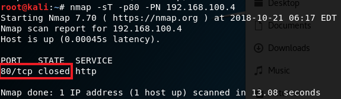

server开启80端口：`nc -lp 80`

查看是否开启：`netstat -an | grep 80`

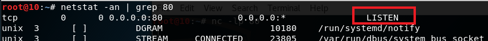

可以看到80端口处于监听状态。

server再监听收包，client执行scapy代码[TCPConnectScan.py](TCPConnectScan.py)

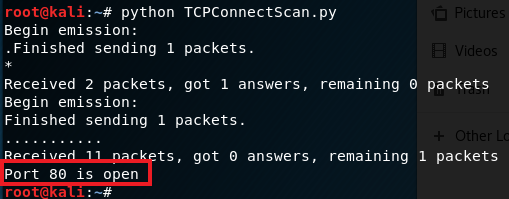

扫描结果显示80端口是开放的。

`wireshark connect.pcap`

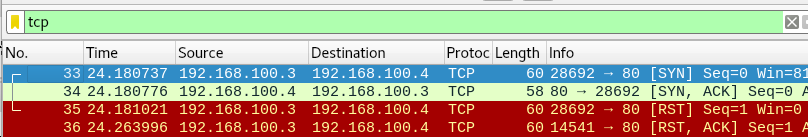

可以看到四个过程
* SYN
* SYN, ACK
* RST
* RST, ACK


连接成功（端口开放）的流程：


Client中用Nmap扫描，也显示80端口开放。与执行scapy代码方式的抓包结果相同。
```
nmap -sT -p80 -PN 192.168.100.4
```

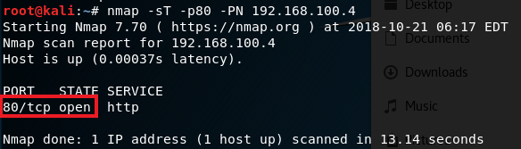

TCP Connect Scan：

* 优点：稳定可靠，不需要特殊的权限。
* 缺点：扫描方式不隐蔽，服务器日志会纪录下大量密集的连接和错误记录，并容易被防火墙发现和屏蔽。

### **TCP stealth scan**

这种技术类似于TCP Connect扫描。客户端发送一个带有SYN标志集和连接到的端口号的TCP包。如果端口打开，服务器响应TCP包内的SYN和ACK标志。但这次客户端在TCP包中发送RST标志，而不是RST+ACK（TCP Connect扫描中的情况）。

TCP stealth scan被用来避免端口扫描检测防火墙。。

server监听eth0：`tcpdump -i eth0 -w stealth.pcap`

client执行代码[TCPStealthScan.py](TCPStealthScan.py)：`python TCPStealthtScan.py`

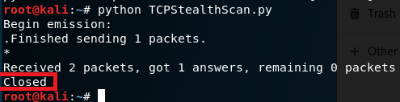

可以看到80端口处于关闭状态。

server：`wireshark stealth.pcap`

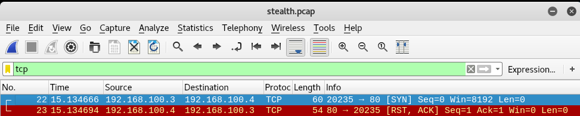

wireshark查看server抓到的包发现进行了[SYN]和[RST,ACK]两步。

端口关闭：


Client中用Nmap扫描，与执行scapy代码方式的抓包结果相同。
```
# -sS 
nmap -sS -p80 -PN 192.168.100.4
```
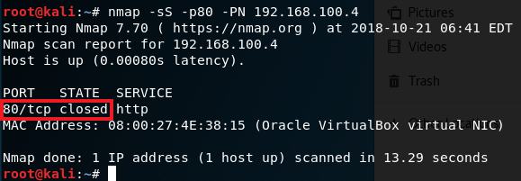

server开启80端口：`nc -lp 80`

server再监听收包，client执行[TCPStealthScan.py](TCPStealthScan.py)：`python TCPStealthScan.py`

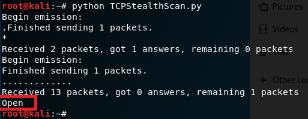

扫描结果显示80端口是开放的。

`wireshark stealth.pcap`

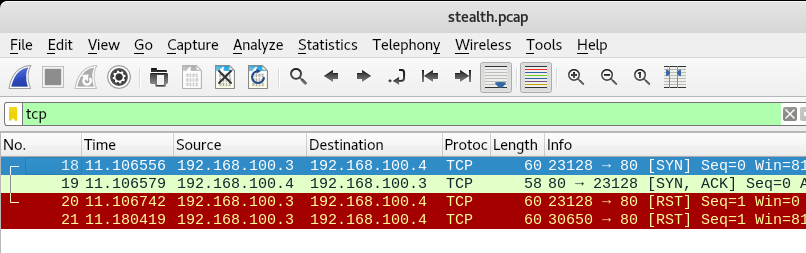

可以看到四个过程
* SYN
* SYN, ACK
* RST
* RST

端口开放（只需要前两步就可以判断端口开放）：


Client中用Nmap扫描，也显示80端口开放。与执行scapy代码方式的抓包结果相同。
```
nmap -sS -p80 -PN 192.168.100.4
```

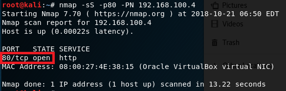

TCP Stealth Scan

* 优点：隐蔽性较全连接扫描好，因为很多系统对这种半扫描很少记录。
* 缺点：构建 SYN 报文需要超级用户权限，且网络防护设备会有记录。


### **TCP XMAS scan**
server监听eth0：`tcpdump -i eth0 -w xmas.pcap`

client执行代码[TCPXmasScan.py](TCPXmasScan.py)：`python TCPSXmasScan.py`，显示server的80端口处于关闭状态。

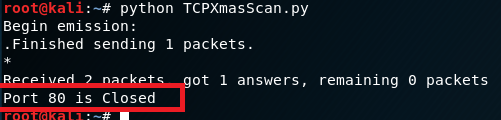

server：`wireshark xmas.pcap`

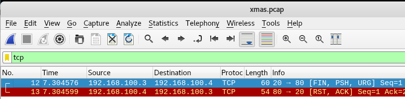

抓的包显示有两个过程
* FIN, PSH, URG
* RST, ACK


Client中用Nmap扫描，显示80端口处于关闭状态
```
# -sX TCP XMAS Scan

nmap -sX -p80 -PN 192.168.100.4
```
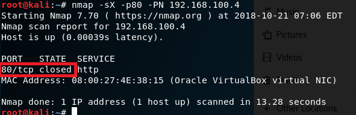

server开启80端口：`nc -lp 80`

server再监听收包`tcpdump -i eth0 -w stealth.pcap`，client执行代码[TCPXmasScan.py](TCPXmasScan.py)：`python TCPXmasScan.py`

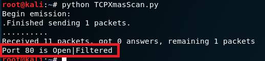

扫描结果显示80端口处于`open|filtered`状态，而非`open`，原因稍后说明。

`wireshark xmas.pcap`

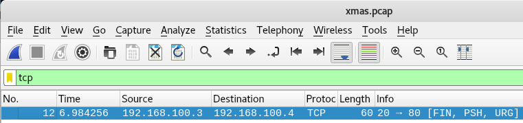

设置FIN，PSH，和URG标志位，其中：
* URG：指示数据时紧急数据，应立即处理。
* PSH：强制将数据压入缓冲区。
* FIN：在结束TCP会话时使用。

正常情况下，三个标志位不能被同时设置，但在TCP XMAS scan中可以用来判断哪些端口关闭还是开放。

端口开放：


Client中用Nmap扫描，显示80端口开放。抓包结果与执行scapy代码相同。
```
nmap -sX -p80 -PN 192.168.100.4
```

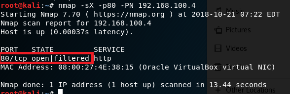

TCP XMAS scan
* 优点：隐蔽性好。
* 缺点：需要自己构造数据包，要求拥有超级用户或者授权用户权限。
    
还有一个很大的不足是许多系统不管端口开放还是关闭，都响应RST，这导致所有端口都标记为closed(关闭的)。另一个不足是它们不能辨别open(开放的)端口和一些特定的filtered(被过滤的)端口，从而返回 open|filtered(开放或者被过滤的)。

### **UDP scan**
UDP扫描一般较慢。UDP扫描发送空的(没有数据)UDP报头到每个目标端口。

* 如果返回ICMP端口不可到达错误(类型3，代码3)， 该端口是closed(关闭的)。
* 其它ICMP不可到达错误(类型3， 代码1，2，9，10，或者13)表明该端口是filtered(被过滤的)。
* 偶尔地，某服务会响应一个UDP报文，证明该端口是open(开放的)。
* 如果几次重试后还没有响应，该端口就被认为是 open|filtered(开放|被过滤的)。这意味着该端口可能是开放的，也可能包过滤器正在封锁通信。 可以用版本扫描(-sV)帮助区分真正的开放端口和被过滤的端口。

53端口处于关闭状态

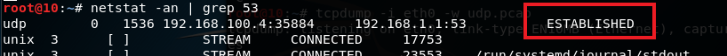

server监听eth0：`tcpdump -i eth0 -w udp.pcap`

client执行代码[UDPScan.py](UDPScan.py)：`python UDPScan.py`，显示53端口处于关闭状态。

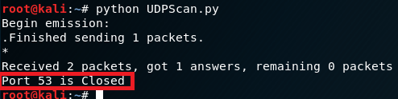

server：`wireshark udp.pcap`

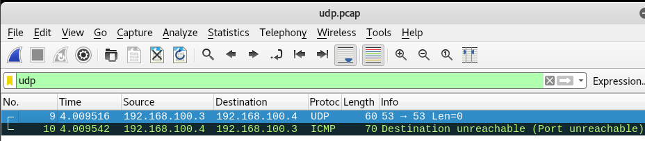

wireshark查看server抓到的包，有一个UDP请求包和一个Destination Unreachable(Port Unreachable)的ICMP包。

端口关闭：

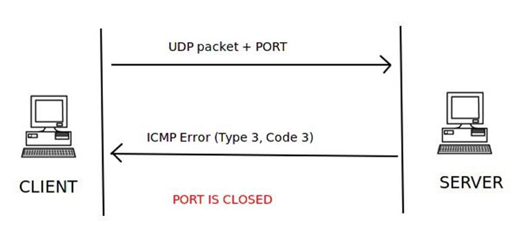

Client中用Nmap扫描，也显示53端口为关闭状态
```
# -sU：UDP scan

nmap -sU -p53 -PN 192.168.100.4
```


server开启53端口：`nc -ulp 53`

server再监听收包，client执行代码[UDPScan.py](UDPScan.py)：`python UDPScan.py`

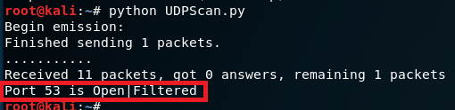

扫描结果显示53端口处于`open|filtered`状态。

`wireshark udp.pcap`
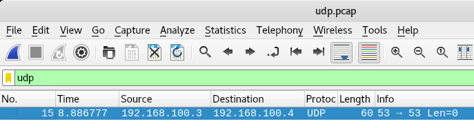

显示有UDP包。且无回复。

端口开放或过滤状态：

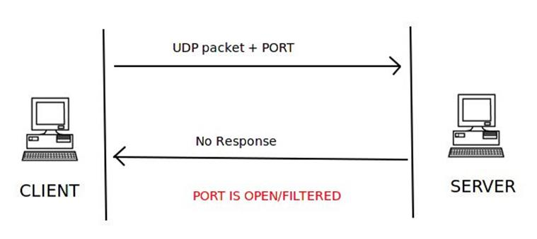

当使用`nc -ulp -p53 < /etc/passwd`指令开启53端口（传输文件以建立连接）

修改[UDPScan.py](UDPScan.py)中：`elif (udp_scan_resp.haslayer(UDP)): `

为：`elif (udp_scan_resp.haslayer(UDP) or udp_scan_resp.getlayer(IP).proto == IP_PROTOS.udp):`

执行`python UDPScan.py`，结果会显示端口为`open`状态。

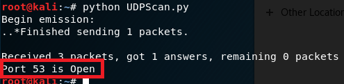

端口开放状态：


Client中用Nmap扫描`nc -ulp 53`，显示53端口**关闭**。
```
nmap -sU -p53 -PN 192.168.100.4
```
需要注意的是，使用nmap进行UDP扫描时，若只是简单使用`-sU`探测，未建立连接，会显示端口关闭。

开启server的53端口数据包发送`nc -ulp -p53 < /etc/passwd`，再用nmap扫描`nmap -sU -p53 -PN 192.168.100.4`

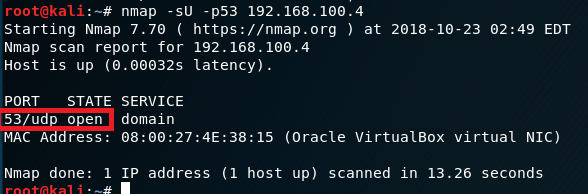

显示53端口开启。

## 三、实验总结拓展
* 端口状态与详细参数说明
    状态 | 详细的参数说明
    - | :- 
    Open | 端口开启，数据有到达主机，有程序在端口上监控
    Closed |  端口关闭，数据有到达主机，没有程序在端口上监控 
    Filtered | 数据没有到达主机，返回的结果为空，数据被防火墙或者是IDS过滤
    UnFiltered | 数据有到达主机，但是不能识别端口的当前状态
    Open/Filtered | 端口没有返回值，主要发生在UDP、IP、FIN、NULL和Xmas扫描中
    Closed/Filtered |只发生在IP ID idle扫描
    |
* 端口扫描分类

    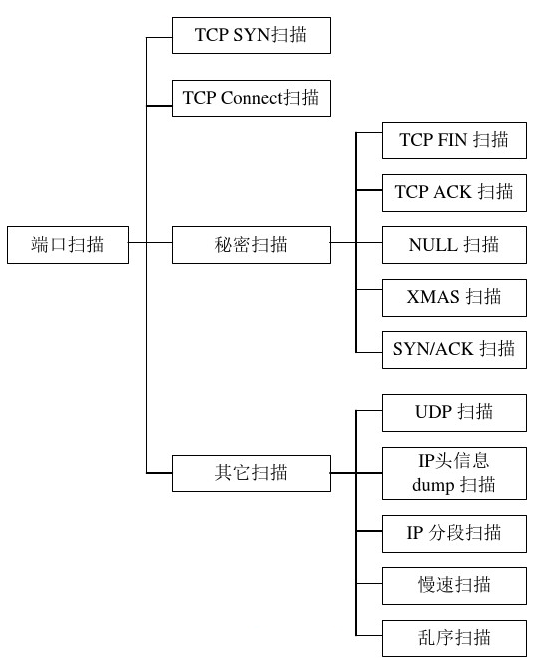
    
## 参考资料
* [port-scanning-using-scapy](http://resources.infosecinstitute.com/port-scanning-using-scapy/)
* [textbook/ns/chap0x05](https://sec.cuc.edu.cn/huangwei/textbook/ns/chap0x05/main.html)
* [CUCCS/2018-NS-Public-xaZKX](https://github.com/CUCCS/2018-NS-Public-xaZKX/blob/ns-chap05/ns-chap05/chap0x05%20编程实验报告.md)
* [Nmap参考指南](https://nmap.org/man/zh/)