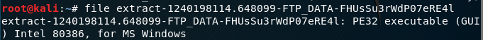

# chap0x12 实战Bro网络入侵取证
* **注**：[据官方](https://blog.zeek.org/)，bro已更名为zeek，但本次实验报告仍沿用bro这一名称。
## 实验内容
* 使用bro来完成取证分析

## 实验过程
1. 安装bro
    ```
    apt-get install bro bro-aux
    ```
    安装成功，查看环境信息
    ```
    # which bro
    /usr/bin/bro

    # bro -v
    bro version 2.5.5

    # lsb_release -a
    No LSB modules are available.
    Distributor ID:	Kali
    Description:	Kali GNU/Linux Rolling
    Release:	kali-rolling
    Codename:	kali-rolling

    # uname -a
    Linux kali 4.18.0-kali2-amd64 #1 SMP Debian 4.18.10-2kali1 (2018-10-09) x86_64 GNU/Linux
    ```

    

2. 编辑bro配置文件
    * 编辑 `/etc/bro/site/local.bro`，在文件尾部追加两行新配置代码
        ```
        @load frameworks/files/extract-all-files
        @load mytuning.bro
        ```

        

    * 在`/etc/bro/site/`目录下创建新文件mytuning.bro，此文件为自定义的规则文件，内容为：
        ```
        redef ignore_checksums = T;
        ```

        

3. 使用bro自动化分析pcap文件

    下载pcap包
    ```
    wget https://sec.cuc.edu.cn/huangwei/textbook/ns/chap0x12/attack-trace.pcap
    ```
    bro分析
    ```
    bro -r attack-trace.pcap /etc/bro/site/local.bro
    ```

    

    出现警告信息
    ```
    WARNING: No Site::local_nets have been defined.  It's usually a good idea to define your local networks.
    ```
    对于本次入侵取证实验来说没有影响。要解决上述警告信息，编辑mytuning.bro，增加一行变量定义`redef Site::local_nets = { 192.150.11.0/24 };`即可。

    在attack-trace.pcap文件的当前目录下会生成一些.log文件和一个extract_files目录，在该目录下我们会发现有一个文件。

    

    

    ```
    # file extract-1240198114.648099-FTP_DATA-FHUsSu3rWdP07eRE4l
    extract-1240198114.648099-FTP_DATA-FHUsSu3rWdP07eRE4l: PE32 executable (GUI) Intel 80386, for MS Windows
    ```
    将该文件上传到[virustotal](https://www.virustotal.com/)

    

    会发现匹配了一个[历史扫描报告](https://virustotal.com/en/file/b14ccb3786af7553f7c251623499a7fe67974dde69d3dffd65733871cddf6b6d/analysis/)，该报告表明这是一个已知的后门程序。

    基于这个发现就可以进行逆向倒推，寻找入侵线索。

    阅读`/usr/share/bro/base/files/extract/main.bro`的源代码

    

    了解到该文件名的最右一个-右侧对应的字符串`FHUsSu3rWdP07eRE4l`是`files.log`中的文件唯一标识。

    通过查看`files.log`，发现该文件提取自网络会话标识（bro根据IP五元组计算出的一个会话唯一性散列值）为`CVs3lAZZG1jh42yja`的FTP会话。

    

    该`CVs3lAZZG1jh42yja`会话标识在`conn.log`中可以找到对应的IP五元组信息。

    

    通过`conn.log`的会话标识匹配，我们发现该PE文件来自于IPv4地址为：`98.114.205.102`的主机。

    通过查看包含该唯一标识`FHUsSu3rWdP07eRE4l`的文件，可进行关联分析
    ```
    grep FHUsSu3rWdP07eRE4l -R .
    ```

    

    可以看到这些文件有`ftp.log`，`pe.log`，`files.log`
    
    查看一下这三个文件的内容：

    ```
    less ftp.log
    ```

    

    ```
    less pe.log
    ```

    

    ```
    less files.log
    ```

    

4. Bro的一些其他技巧
    * `ftp.log`中默认不会显示捕获的FTP登录口令，我们可以通过在 `/etc/bro/site/mytuning.bro`中增加以下变量重定义来实现：
        ```
        redef FTP::default_capture_password = T;
        ```

        

        

    * SMB协议识别
    
        2.5Beta：打开`/etc/bro/site/local.bro`将`@load policy/protocols/smb`取消注释。2.5Beta可以很好的识别出SMB协议流量。

## 参考
* [textbook/ns/chap0x12/exp.html](https://sec.cuc.edu.cn/huangwei/textbook/ns/chap0x12/exp.html)